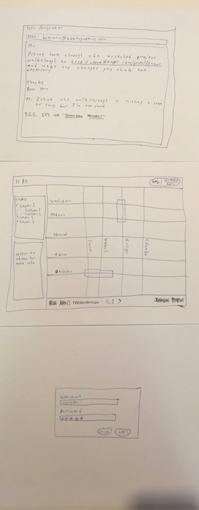
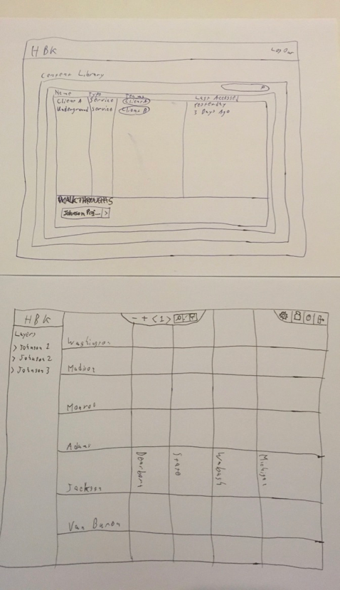
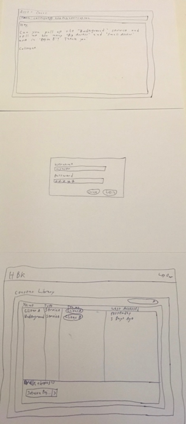
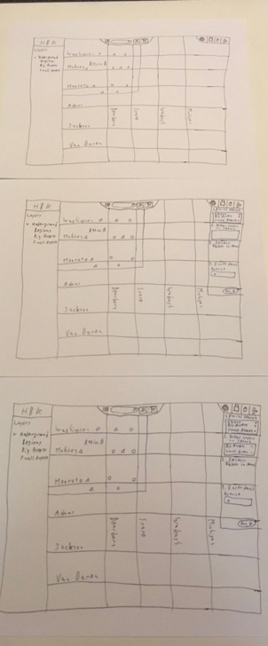
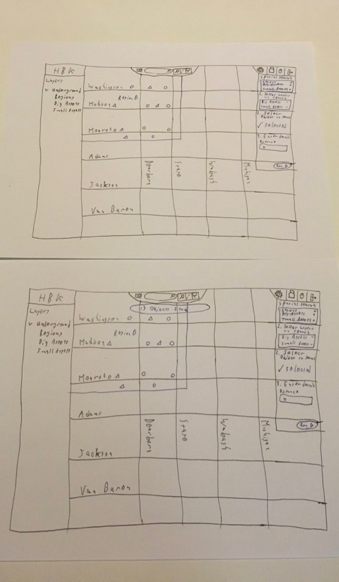
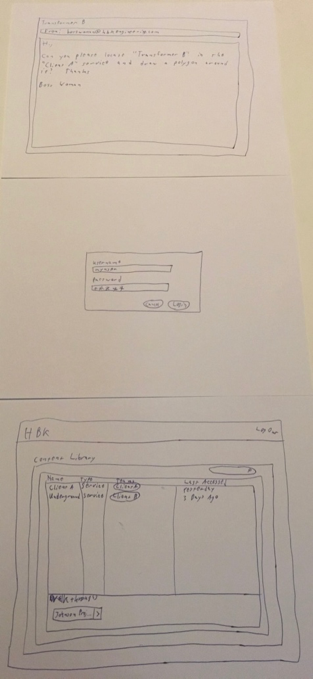
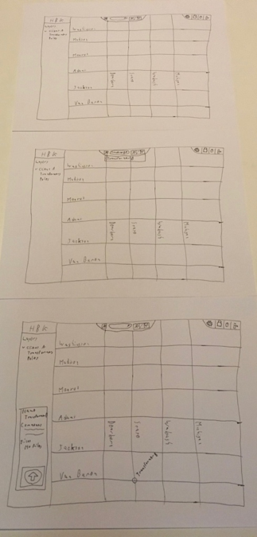
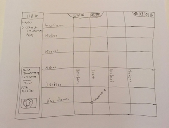

# Formative Evaluation
The formative evaluation for this project consisted of a cognitive walkthrough involving two users of the current version of the application. One of them was more experienced in using the system than the other was, which was helpful in gaining insight into how a novice user might approach the system.

Three evaluation scenarios were created to validate solutions to the design challenges related to this project: content organization, spatial query execution, presentation or “project walkthrough” interfaces, and the overall layout of the map page. Each scenario started with a mock email instructing the “user” to perform a task, such as might happen in day-to-day use of the system. Specific scenarios are described in greater detail below.

## Challenges
Several notable challenges were encountered while users were performing the evaluation scenarios. The first challenge was that users were accustomed to the existing application, and the updated interfaces seemed confusing at times because of this. A second challenge was that the users surveyed attempted to perform the tasks at several instances in ways that were not “supported” by the prototype system but which would be perfectly legal in general. A third challenge, or oversight, was that users were not given enough information about new features or changes to perform their tasks successfully. Fortunately, this oversight provided some “insight” into how the system might be received in a subsequent rollout of the changes. A final challenge was determining how to word the provided tasks without revealing too much of the desired process to users.

## Scenario 1 - Modifying an existing “project walkthrough”

 
*Figure 17 - Prototype for Scenario 1*

### Script
The goal for Scenario 1 was for the user to add a “step” to an existing project walkthrough, as accomplished by the following script:
1.	“Click” the link provided in the email
2.	“Click” the “Next” arrow at the bottom of the walkthrough screen to see if there are additional steps
3.	Decide, based on the task given in the email, to log into the application
4.	“Click” the “Get Access/Login” button at the top right
5.	“Click” the “Login” button on the login prompt
6.	Find the “Johnson Project” walkthrough near the bottom of the subsequent screen
7.	“Click” the “+” icon on the toolbar to add a step
8.	(End Scenario)

### Results
Based on observations, users tended to rush through the “read-only” walkthrough mode or, because of their familiarity with the current application, did not realize that they were not already “authenticated”. It also seemed unclear or confusing what a “project walkthrough” was.

## Scenario 2 - Performing a spatial query

  
*Figure 18 - Prototype for Scenario 2*

### Script
The goal for Scenario 2 was for the user to count the number of geometries in an area by running a spatial query on that area. The ideal process is outlined below:
1.	Decide to log into the application after receiving the task email
2.	“Click” the “Login” button to log in
3.	“Click” the “Underground” link on the content listing
4.	“Click” the icon to the left of the search field to open the spatial query pane
5.	“Click” the “+” icon next to “Big Assets” and “Small Assets” in the spatial query pane
6.	Observe that the selected layers were added to the box under “Step 1” in the spatial query pane
7.	“Click” the geometry labeled “Region B”
8.	Observe that a “Selected” indicator is added to the area under “Step 2” in the spatial query pane
9.	“Click” the “Run” button to execute the spatial query
10.	Observe that 13 records are found in Region B
11.	(End Scenario)

### Results
While performing this exercise, one user tried to individually count the shapes because they weren’t aware that a spatial query could be used to accomplish the task. Both users instinctively went to the left layer pane to verify that they would be searching the right layers, rather than indicating their selections in the spatial query pane. It also seemed unclear what needed to happen once the layers to be searched were added to the box in “Step 1”.

## Scenario 3 - Drawing around an asset
  
*Figure 19 - Prototype for Scenario 3*

### Script
The goal for Scenario 3 was for the user to draw an arbitrary outline around the geometry labeled “Transformer B”, ideally following the below procedure:
1.	Decide to log into the application after receiving the task email
2.	“Click” the “Login” button to log in
3.	“Click” the “Client A” link on the content listing
4.	Observe that the geometry in question is not currently visible
5.	Decide to search for the geometry in question
6.	“Type” the text “Transformer B” in the search field at the top of the screen
7.	Observe that an autocomplete drop-down option appears
8.	“Click” the autocomplete drop-down option labeled “Transformer B”
9.	Observe that the selected geometry is now visible
10.	Activate the drawing tools by “clicking” on the “pencil” icon
11.	Observe that several additional icons appear upon “clicking” the “pencil”
12.	Activate the polygon drawing mode by “clicking” on the “polygon” icon
13.	“Click” the map several times to enclose “Transformer B” in a polygon
14.	(End Scenario)

### Results
Users were observed to be less confident about their actions when performing this task. They were both able to reach the map page easily, but had difficulty determining how the geometry could be located. Instinctively, one of the users clicked the pencil icon then immediately started clicking the map, which was surprising.

## Overall Feedback
Through these formative evaluations, we found several areas in our initial designs which need refinement. One of the users indicated that hiding the search field when entering “edit” mode might be confusing for many users. The spatial query process also still seemed rather “clumsy” for both users. Both users tried to start drawing immediately after “clicking” the “edit” icon on the map page, which seems indicative of a needed change. One user also encouraged the creation of a menu of “functions” for advanced operations like spatial queries, and this idea will be incorporated into future iterations. Additionally, we will stop “hiding” the search field when another interaction mode is entered, and we will try to investigate ways in which the spatial query process may be refined. We will also try to determine how some of the other “hangups” discussed in the preceding results sections can be addressed.
