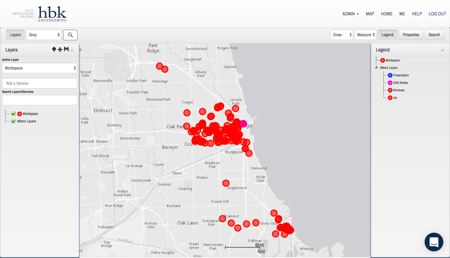
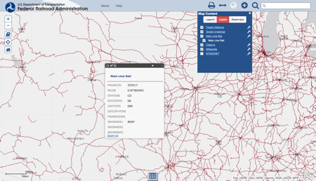
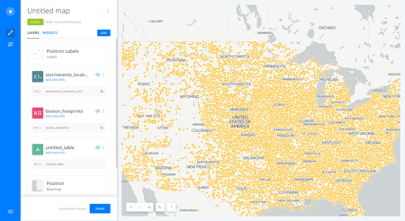
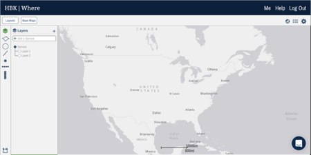

# Introduction

## About Me
I am Mike Naughton, a lead software engineer at a civil engineering services firm which focuses on utility engineering. My job duties primarily involve developing and maintaining a web-based geographic information system (Figure 1) which is used by various stakeholders within and external to the company.

*Figure 1 - Screenshot of existing GIS system*

My semester project for this class consisted of *exploring* the idea of making several notable modifications to this application and evaluating user responses to those modifications. I emphasize “exploring”, as some changes may not be approved for production use.

## Background
At its core, the aforementioned web application allows users to organize, author, and review spatial content and associated files and metadata. Application content is heterogeneous: it may be derived from ESRI data sources, a Mongo database, or flat files. Built on top of the core functionality are features for search, data import and export, and basic geospatial querying. As with any application, there is also some administrative functionality.

In a company of roughly 450 individuals, there are approximately 120 monthly active users and 40 daily active users. Aside from administrators, there are three general types of users of the application, and these have been compiled as [user stories](user_stories.html).

## Project Goals

Upon compilation of user stories, it became evident that there were several pain points in using the system.

1. Inefficiency - [Daphne](user_stories.html#daphne) and [Mark](user_stories.html#mark) were both frustrated by how long things seemed to take
2. Mismatch of mental model - Daphne was also confused when content sometimes wasn't saved when she thought it would be
3. Complexity - Mark was occasionally confused by the number of available functions in the system.
4. Flexibility and reliability - [Jim](user_stories.html#jim) never felt comfortable using the system in client-facing presentations

Over the course of the project, I hoped to correct some or all of these problems, by focusing on emphasizing “popular” functions used by content authors (like Daphne) and consumers (like Mark). I also hoped to improve the presentation experience for users like Jim.

## Related Work
There are several well-known interfaces for interacting with geospatial information. Among these are Google Earth, ESRI (Figure 2), and CartoDB (Figure 3). Each offers a slightly different philosophy regarding interface layout and overall experience. Additionally, a colleague that I work with has developed some conceptual wireframes (Figure 4) which were a good reference point, as well.

*Figure 2 - Screenshot of ESRI web map*

*Figure 3 - Screenshot of CartoDB application*

*Figure 4 - GIS application wireframe*

As far as formal research is concerned, much of it seems to focus on geospatial usage on small screens and handheld devices or table tops rather than full-sized workstation displays or large wall-mounted displays. One article which evaluates interface alternatives for geospatial systems is “Multimodal Interactive Maps: Designing for Human Performance” [[1]](#references). The focus on that article is on speech-driven input, which was not ultimately feasible for this project.

# Approach

## Requirements
In order to obtain some baseline requirements for this project, a [survey](res/survey.pdf) was sent to 80 selected users of the production application, and the survey received 39 responses in total. From those requirements, it was evident that there were two primary segments of users; approximately two thirds identified as primarily content consumers and approximately one third identified as primarily content creators. It also became clear that certain functions were used more often than others. Of the most used were:

- Search by keyword
- Spatial search
- Working with files
- Viewing tabular outputs of spatial data

After some brainstorming, it was decided that this project would focus on creating several different interaction "modes" for the application. For instance, a content creator might see something different than a content consumer. Additionally, the idea of a public "project walkthrough" was envisioned, where a user could publish a limited view of data and jump through the spatial data, much like in a slide presentation. Once the initial brainstorming had been completed, applicable [requirements](requirements.html) were written. Given that this was a production application, the requirements focused on changes and additions rather than encompassing the entire application functionality.

## Sketches
Once requirements were written, I began [sketching](sketches.html) a large number of possibilities for how the requirements might be fulfilled, focusing on improving several particular use cases. I worked with a colleague to trim down the sketches and select some alternatives to elaborate on.

## Formative Evaluation
After satisfactorily iterating on sketch work, I created some detailed sketches to serve as prototypes in a "cognitive walkthrough" style [evaluation](formative_evaluation.html).

### Challenges
Several notable challenges were encountered while users were performing the evaluation scenarios. The first challenge was that users were accustomed to the existing application, and the updated interfaces seemed confusing at times because of this. A second challenge was that the users surveyed attempted to perform the tasks at several instances in ways that were not “supported” by the prototype system but which would be perfectly legal in general. A third challenge, or oversight, was that users were not given enough training regarding new features or changes to perform their tasks successfully. Fortunately, this oversight provided some “insight” into how the system might be received in a subsequent rollout of the changes. A final challenge was determining how to communicate the desired tasks without revealing too much of the intended process to users.

### Results
The formative evaluation directed us to several areas in our initial designs which needed refinement. One of the users indicated that hiding the search field when entering “edit” mode might be confusing for many users. The spatial query process also still seemed rather “clumsy” for both users. Both users tried to start drawing immediately after “clicking” the “edit” icon on the map page, which seemed indicative of a needed change. One user also encouraged the creation of a menu of “functions” for advanced operations like spatial queries, and this idea was incorporated into the functional prototype. Additionally, we decided to stop “hiding” the search field when another interaction mode is entered, and we tried to investigate ways in which the spatial query could have been refined. We also tried to determine how some of the other “hangups” users encountered could be addressed.

# Project Outcome

## Functional Prototype
Although a high fidelity prototype was created using Adobe(c) Experience Design, I decided to create a [functional prototype](#demo-video) which could consume live data hosted on our API. Although the functional prototype was fairly "stripped-down", it yielded valuable results for a summative evaluation. Ultimately, given various constraints, it was only possible to implement two of the three scenarios evaluated during formative evaluation.

## Summative Evaluation
Ultimately, four users participated in the summative evaluation. Of these users, two of them are very experienced with the existing application, one of them is experienced, and one of them is still fairly new to the application. (*Note: these categories have not been operationalized, but are useful for discussion*). The users were asked to draw around a location found using the search bar and to perform a spatial query using applicable data. Unfortunately, their interactions were not precisely timed, but none of the users took more than two to three minutes to perform the desired tasks. The newer user made a few mistakes in trying to draw an object, but declared that training would resolve those issues. The experienced user and one of the very experienced users were unsure when to do what on the spatial query task, but had little trouble finding the screen. This might indicate that additional cues could be used to direct user focus.

Each user completed a standard System Usability Scale survey at the end of their interaction. Their resulting scores are shown below.

| User               | Score |
|:-------------------|------:|
| Very Experienced 1 |    75 |
| Very Experienced 2 |    85 |
| Experienced        |  72.5 |
| Novice             |    65 |

## Demo Video

<iframe width="560" height="315" src="https://www.youtube.com/embed/8ml9GP2a0aY" frameborder="0" allowfullscreen></iframe>

# References
1. Oviatt, Sharon. "Multimodal interactive maps: designing for human performance." Human-Computer Interaction 12.1 (1997): 93-129.
