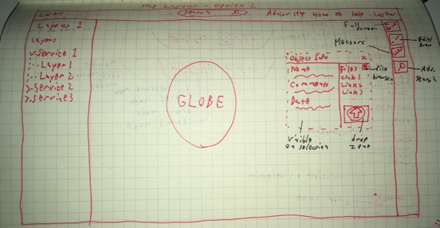

# Sketch Diary
## Design Challenge 1 - Content Organization
### Goals
- Distinguish by work group and content type
- Include content metadata
- Include search

*Figure 5 - Alternative 1 uses tabs to differentiate content types and tags to differentiate teams*

*Figure 6 - Alternative 2 uses tabs to differentiate teams and boxes to differentiate content types*

*Figure 7 - Alternative 3 uses fields and boxes to differentiate content types and tags to differentiate teams*

### Comments
Alternative 2 seems like it would be most visually appealing on a large screen, but when there are many content items, alternative 3 seems to be best. Alternative 1 places presentations on the same level as services and layouts, and this may not make sense.

## Design Challenge 2 - Public Link Appearance
### Goals
- Simplified interface
- Documentation
- On-boarding
- Presentation navigation

*Figure 8 - Alternative 1 uses a single sidebar for all interactions*

*Figure 9 - Alternative 2 uses two sidebars and places presentation navigation in header*

*Figure 10 - Alternative 3 uses a single sidebar and a footer for presentation navigation*

### Comments
Alternative 3 seems most appealing. It is clear to a user that they are or are not looking at a presentation, but map area is still maximized while leaving room for other interactions.

## Design Challenge 3 - Map Page Layout
### Goals
- Minimize clutter
- Maximize map area
- Emphasize search
- Emphasize common functions such as drawing, measuring, and slide creation

*Figure 11 - Alternative 1 places search in the toolbar and uses a floating properties window*

*Figure 12 - Alternative 2 places search in the header and uses a vertical toolbar instead of a horizontal toolbar*

*Figure 13 - Alternative 3 minimizes the area for controls and places all interaction into a single sidebar*

### Comments
Alternative 3 offers a fresh perspective on how the layout of the page could look. It offers maximal map area while minimizing the clutter introduced by an invasive toolbar and header. It also allows users to quickly switch between usage modes.

## Design Challenge 4 - Spatial Query Interface
### Goals
- Clarify process in user interface
- More accessible for new users
- Still efficient for experienced users

*Figure 14 - Alternative 1 places a step-by-step wizard underneath the right controls*

*Figure 15 - Alternative 2 places a step-by-step wizard underneath the center controls*

*Figure 16 - Alternative 3 places a sequential interface on the right-hand side of the window*

### Comments
Use of a wizard seems less-than-ideal for the spatial query process, and would be a hindrance to more experienced users. Thus, alternative 3 seems to be the best choice of these alternatives.
